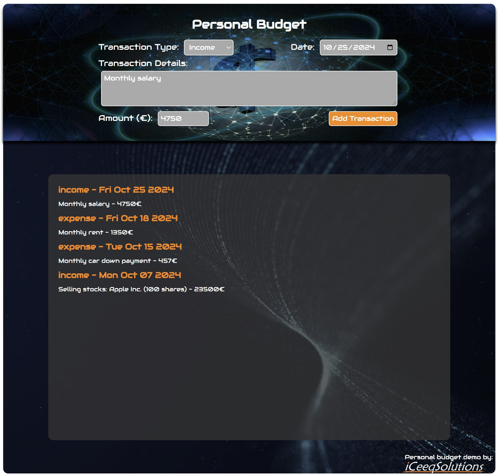

# Personal Budget - Simple TypeScript demo containing a TS interface and modules.

  TypeScript Demo by <a href="https://iceeqsolutions.fi/">iCeeqSolutions</a>

## About

The Personal Budget is a simple TypeScript demo demonstrating the use of interfaces and modules.

By using the input fields on the page, users are able to add items to the list.

We've added two separate modules - income and expense - that are being utilized by the app based on which transaction type is picked from the drop-down. Currently both modules are identical in content, but having this setup in place leaves room for flexibility, should there ever be a need to present different content based on transaction type in the future.

## Demo

👁️ [Live Demo](https://iceeqsolutions.github.io/personal-budget/)

## Built with

- TypeScript
- CSS
- Prettier

## Features

- Form element
- Modules
- TS interface

  

  
